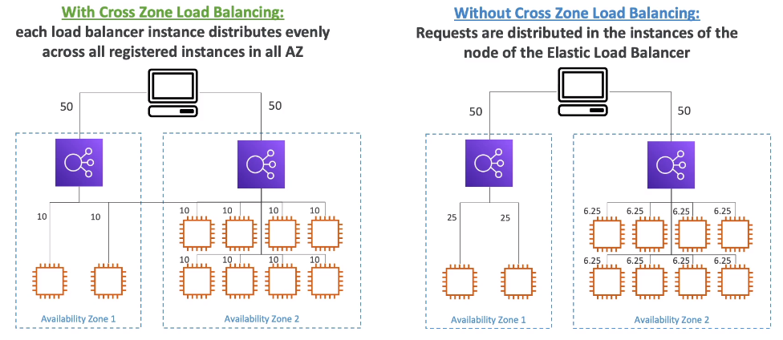
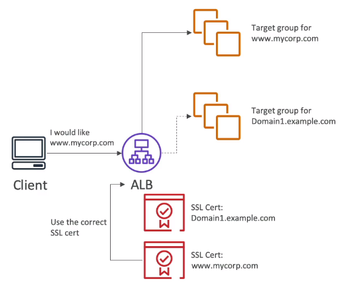

# Amazon Elastic Load Balancer (ELB)
Elastic Load Balancing automatically distributes incoming application traffic across multiple targets, such as Amazon EC2 instances, containers, IP addresses, and Lambda functions.

It expose a single point of access to your application and can handle the varying load of your traffic in a single Availability Zone or across multiple Availability Zones. Elastic Load Balancing **offers three types of load balancers** that all feature the high availability, automatic scaling, and robust security necessary to make your applications fault tolerant.

Load Balancers can be setup as internal (private) or external (public) ELB.

#### Health Check
 - Is a way for ELB to verify whether or not an EC2 instance is properly working
 - The health check is done on port and a route (/health is a common route)
 - If the response is not 200 (OK), then the instance is unhealthy and the ELB will stop sending traffic to that instance.

## Useful links
- [AWS - Elastic Load Balancing FAQ](https://aws.amazon.com/elasticloadbalancing/faqs/?nc=sn&loc=6)

## Types
### Application load balancer (ALB)
- Best suited for HTTP and HTTPS traffic
- Operate at individual request level (Layer 7) and are application-aware
- Can be used to create advanced request routing base on url path, hostname, query string and Headers
- Routes traffic to targets within VPC based on the content of the request
- Request tracing is enabled by default
- Great for microservices & container-based applications (docker/ECS)
- Load balancing to multiple applications on the same machine

### Network load balancer (NLB)
- Best suited for TCP and UDP traffic where **extreme performance** is required
- Operate at connection level (Layer 4)
- Is capable of handling millions of requests per second, maintaining ultra-low latencies
- Higher costs
- One static IP per AZ, and supports assigning [Elastic IP](https://docs.aws.amazon.com/AWSEC2/latest/UserGuide/elastic-ip-addresses-eip.html)
- Target groups for NLB are EC2 instances, private IP addresses, Application Load Balancer
- Health checks supports the TCP, HTTP and HTTPS protocols

### Gateway load balancer
- Deploy, scale,and manage a fleet of 3rd party network virtual appliances in AWS
- Example: Firewalls, Intrusion Detection, Deep Packet Inspection System, payload manipulation, ...
- Operates at Layer 3 (Network Layer) - IP Packets
- Uses the **GENEVE** protocol on port 6081

### Classic load balancer (Deprecated)
- Legacy, not recommended
- Can be used for both HTTP/HTTPS (Layer 7) and TCP (Layer 4)

## General Notes
- When a classic load balancer stops responding, it responds with a 504 error (Gateway timeout). This means that the app is not responding within the idle timeout period
- Fixed hostname (XXX.region.elb.amazonaws.com)
- Application servers don't see the ip of the client directly
  - You can use the header **X-Forwarded-For** to get the IPv4 address of your end user

#### Sticky Session (Session Affinity)
- Same client is always redirected to the same instance behind a load balancer
- Works for CLB and ALB
- The "cookie" used for stickiness has an expiration date you control
- May bring imbalance to the load over the backend EC2 instances
- **Cookie Names**:
  - **Application-based Cookie**: Generate by user or Load Balancer
  - **Duration-based Cookie**: Generated by Load Balancer

#### Cross Zone Load Balancing
- Each load balancer instance distributes traffic evenly across all registered instances in all AZ
- EX: If we have AZ 1 with 2 ec2 instances and AZ 2 with 8 EC2 instances and both AZ with 1 Load balancer each. The traffic will be received 50% for each load balance but they will be redirected to all 10 ec2 instances evenly.

- **Application Load Balancer**
  - Enabled by default (can be disabled at Target Group level)
  - No charge for inter AZ data
- **Network Load Balancer & Gateway Load Balancer**
  - Disabled by default
  - You pay charges for inter AZ data if enabled

#### Load Balancer - SSL Certificates
- User connect to the Load Balancer through HTTPS (encrypted) over WWW and the Load Balancer can connect through HTTP over private vpc to the EC2 Instance
- The load balancer uses an X.509 certificate (SSL/TLS server certificate)
- You can manage certificates using [ACM](./ACM.md)
- Https listener:
  - You must specify a default certificate and can add an optional list of certs to support multiple domains
  - Clients can use **SNI** (Server Name Indication) to specify the hostname they reach
- **SNI**:
  - Solves the problem of loading **multiple SSL certificates onto one web server** (to serve multiple websites)
  - "Newer" protocol that **requires** the user to indicate the hostname in the initial SSL handshake
  - The server will then find the correct cert, or return the default one.
  - Note:
    - Only works for ALB & NLB (Newer generation), Cloudfront
    

#### Deregistration delay
- Defined time to complete "in-flight request" while the instance is de-registering or unhealthy
- Stops sending new requests to the EC2 instance which is de-registering
- You can define value between 1 to 3600 seconds (default 300)
- can be disabled (set value to 0)
- Set to low value if your request are short